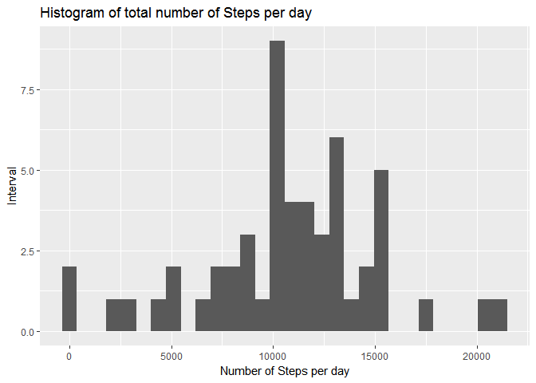
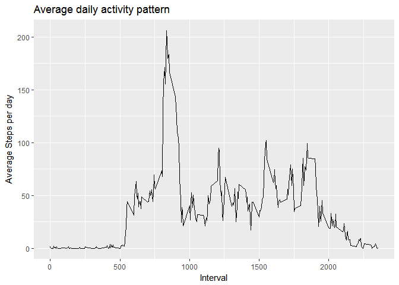
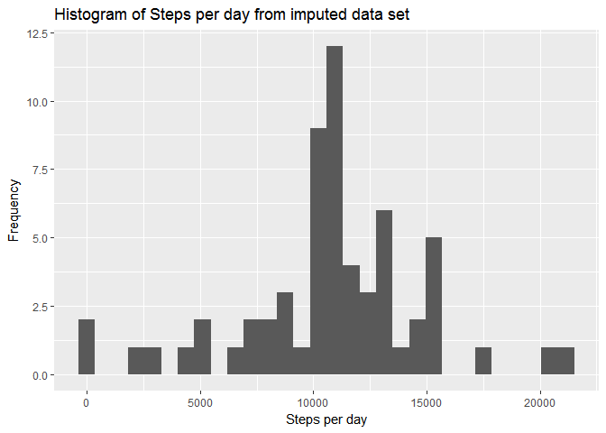
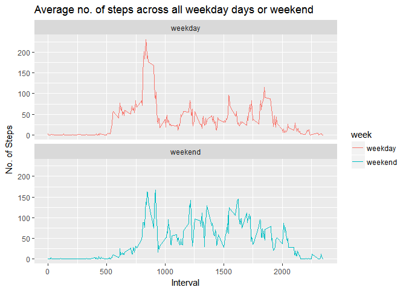

## Introduction
This assignment makes use of data from a personal activity monitoring device. This device collects data at 5 minute intervals through out the day. The data consists of two months of data from an anonymous individual collected during the months of October and November, 2012 and include the number of steps taken in 5 minute intervals each day.
The variables included in this dataset are:

- steps: Number of steps taking in a 5-minute interval (missing values are coded as NA)

- date: The date on which the measurement was taken in YYYY-MM-DD format

- interval: Identifier for the 5-minute interval in which measurement was taken

The dataset is stored in a comma-separated-value (CSV) file and there are a total of 17,568 observations in this dataset.

The GitHub repository created for this assignment is forked and cloned from https://github.com/rdpeng/RepData_PeerAssessment1)

NOTE: The GitHub repository also contains the dataset for the assignment so you do not have to download the data separately.

This assignment has been prepared based on: RStudio Version 1.1.447, R version 3.5.0, lubridate_1.7.4, dplyr_0.7.4, ggplot2_2.2.1

Set working directory to cloned directory and Check the files available in cloned directory.

## Loading and preprocessing the data

Load necessary library packages to manipulate data, dates and for plotting graphs. 


```r
library(dplyr)
```

```
## 
## Attaching package: 'dplyr'
```

```
## The following objects are masked from 'package:stats':
## 
##     filter, lag
```

```
## The following objects are masked from 'package:base':
## 
##     intersect, setdiff, setequal, union
```

```r
library(lubridate)
```

```
## 
## Attaching package: 'lubridate'
```

```
## The following object is masked from 'package:base':
## 
##     date
```

```r
library(ggplot2)
```

Unzip the zipped data file.


```r
unzip("activity.zip")
```

### 1. Load the data (i.e. read.csv())


```r
activityData <- read.csv("activity.csv", header=TRUE, sep = ",")
```

### 2. Process/transform the data (if necessary) into a format suitable for your analysis.

Check the structure, head, tail and summary of data.


```r
str(activityData)
```

```
## 'data.frame':	17568 obs. of  3 variables:
##  $ steps   : int  NA NA NA NA NA NA NA NA NA NA ...
##  $ date    : Factor w/ 61 levels "2012-10-01","2012-10-02",..: 1 1 1 1 1 1 1 1 1 1 ...
##  $ interval: int  0 5 10 15 20 25 30 35 40 45 ...
```

```r
head(activityData)
```

```
##   steps       date interval
## 1    NA 2012-10-01        0
## 2    NA 2012-10-01        5
## 3    NA 2012-10-01       10
## 4    NA 2012-10-01       15
## 5    NA 2012-10-01       20
## 6    NA 2012-10-01       25
```

```r
tail(activityData)
```

```
##       steps       date interval
## 17563    NA 2012-11-30     2330
## 17564    NA 2012-11-30     2335
## 17565    NA 2012-11-30     2340
## 17566    NA 2012-11-30     2345
## 17567    NA 2012-11-30     2350
## 17568    NA 2012-11-30     2355
```

```r
summary(activityData)
```

```
##      steps                date          interval     
##  Min.   :  0.00   2012-10-01:  288   Min.   :   0.0  
##  1st Qu.:  0.00   2012-10-02:  288   1st Qu.: 588.8  
##  Median :  0.00   2012-10-03:  288   Median :1177.5  
##  Mean   : 37.38   2012-10-04:  288   Mean   :1177.5  
##  3rd Qu.: 12.00   2012-10-05:  288   3rd Qu.:1766.2  
##  Max.   :806.00   2012-10-06:  288   Max.   :2355.0  
##  NA's   :2304     (Other)   :15840
```

It is better to load data again to coerce all columns ("steps", "date" and "interval") to appropriate class ("numeric", "character", "integer").


```r
activityData <- read.csv("activity.csv", header = TRUE, sep = "," , 
                         colClasses = c("numeric", "character", "integer"))
```

Let us tidy the data. Change the date into date format using lubridate package.


```r
activityData$date <- ymd(activityData$date)
```

Check the structure/summary of data.


```r
str(activityData)
```

```
## 'data.frame':	17568 obs. of  3 variables:
##  $ steps   : num  NA NA NA NA NA NA NA NA NA NA ...
##  $ date    : Date, format: "2012-10-01" "2012-10-01" ...
##  $ interval: int  0 5 10 15 20 25 30 35 40 45 ...
```

```r
summary(activityData)
```

```
##      steps             date               interval     
##  Min.   :  0.00   Min.   :2012-10-01   Min.   :   0.0  
##  1st Qu.:  0.00   1st Qu.:2012-10-16   1st Qu.: 588.8  
##  Median :  0.00   Median :2012-10-31   Median :1177.5  
##  Mean   : 37.38   Mean   :2012-10-31   Mean   :1177.5  
##  3rd Qu.: 12.00   3rd Qu.:2012-11-15   3rd Qu.:1766.2  
##  Max.   :806.00   Max.   :2012-11-30   Max.   :2355.0  
##  NA's   :2304
```
## What is mean total number of steps taken per day?
#### For this part of the assignment, you can ignore the missing values in the dataset.
### 1. Calculate the total number of steps taken per day
Use dplyr package, ignore (filter) NA/missing data and calculate total number of steps per day, group by date, summarize the sum of steps and print.


```r
totalSteps <- activityData %>%
        filter(!is.na(steps)) %>%
        group_by(date) %>%
        summarize(steps = sum(steps)) %>%
        print
```

```
## # A tibble: 53 x 2
##    date       steps
##    <date>     <dbl>
##  1 2012-10-02   126
##  2 2012-10-03 11352
##  3 2012-10-04 12116
##  4 2012-10-05 13294
##  5 2012-10-06 15420
##  6 2012-10-07 11015
##  7 2012-10-09 12811
##  8 2012-10-10  9900
##  9 2012-10-11 10304
## 10 2012-10-12 17382
## # ... with 43 more rows
```

### 2. If you do not understand the difference between a histogram and a barplot, research the difference between them. Make a histogram of the total number of steps taken each day.

Use ggplot for making the histogram.


```r
ggplot(data=totalSteps, aes(x=steps)) +
        geom_histogram() +
        labs(title="Histogram of total number of Steps per day", 
             x = "Number of Steps per day", y = "Interval") 
```

```
## `stat_bin()` using `bins = 30`. Pick better value with `binwidth`.
```

<!-- -->

### 3. Calculate and report the mean and median of the total number of steps taken per day

Calculate mean and median of total number of steps taken per day and report using print and paste function.


```r
meanSteps <- mean(totalSteps$steps)
medianSteps <- median(totalSteps$steps)
print(paste("Mean of the steps are:", meanSteps), quote = FALSE)
```

```
## [1] Mean of the steps are: 10766.1886792453
```

```r
print(paste("Median of the steps are:", medianSteps), quote = FALSE)
```

```
## [1] Median of the steps are: 10765
```

## What is the average daily activity pattern?

### 1. Make a time series plot (i.e. type="l") of the 5-minute interval (x-axis) and the average number of steps taken, averaged across all days (y-axis)

Calculate the average number of steps taken in each 5-minute interval per day. First filter NA/missing data and Group data by interval and summarize the mean of steps and print.


```r
intervalData <- activityData %>%
        filter(!is.na(steps)) %>%
        group_by(interval) %>%
        summarize(steps = mean(steps))
```

Now make a time series plot (i.e. type = "l") using geom_line().


```r
ggplot(intervalData, aes(x = interval , y = steps)) + 
        geom_line() + 
        labs(title = "Average daily activity pattern", 
             x = "Interval", y = "Average Steps per day") 
```

<!-- -->

### 2. Which 5-minute interval, on average across all the days in the dataset, contains the maximum number of steps?

Use which.max() function to find the maximum number of steps, on average across all the days in the dataset.


```r
maxSteps <- intervalData[which.max(intervalData$steps),]

print(paste("The interval ", maxSteps$interval, "contains the maximum number of steps =",
            maxSteps$steps, "on average."), quote = FALSE)
```

```
## [1] The interval  835 contains the maximum number of steps = 206.169811320755 on average.
```

## Imputing missing values

Note that there are a number of days/intervals where there are missing values (coded as NA). The presence of missing days may introduce bias into some calculations or summaries of the data.

### 1. Calculate and report the total number of missing values in the dataset (i.e. the total number of rows with NAs)

Check all the rows of dataset with missing values using complete.cases function and calculate number of rows with nrow function.


```r
rowswithNAs <- activityData[!complete.cases(activityData),]
totalNAs <- nrow(rowswithNAs)
print(paste("Total number of rows with missing values in the dataset = ", totalNAs ), 
      quote = FALSE)
```

```
## [1] Total number of rows with missing values in the dataset =  2304
```

### 2. Devise a strategy for filling in all of the missing values in the dataset. The strategy does not need to be sophisticated. For example, you could use the mean/median for that day, or the mean for that 5-minute interval, etc.

Check all the columns if they have any missing values using colSums function.


```r
colSums(is.na(activityData))
```

```
##    steps     date interval 
##     2304        0        0
```

Strategy: Since only the "steps" column has missing values, we need to find the mean of the 5 minute interval using tapply function and fill the missing values in "steps" column.


```r
meanInterval <- tapply(activityData$steps, activityData$interval, mean, na.rm=TRUE, simplify=TRUE)
```


### 3. Create a new dataset that is equal to the original dataset but with the missing data filled in.

Create new dataset - dataNoNAs and fill the missing values with mean of interval for that day.


```r
dataNoNAs <- activityData
NoNAs <- is.na(dataNoNAs$steps)
dataNoNAs$steps[NoNAs] <- meanInterval[as.character(dataNoNAs$interval[NoNAs])]
head(dataNoNAs)
```

```
##       steps       date interval
## 1 1.7169811 2012-10-01        0
## 2 0.3396226 2012-10-01        5
## 3 0.1320755 2012-10-01       10
## 4 0.1509434 2012-10-01       15
## 5 0.0754717 2012-10-01       20
## 6 2.0943396 2012-10-01       25
```

Check if there are any missing values.


```r
sum(is.na(dataNoNAs))
```

```
## [1] 0
```


### 4. Make a histogram of the total number of steps taken each day and Calculate and report the mean and median total number of steps taken per day. Do these values differ from the estimates from the first part of the assignment? What is the impact of imputing missing data on the estimates of the total daily number of steps?

Calculate total number of steps taken each day.


```r
stepsEachday <- dataNoNAs %>%
        group_by(date) %>%
        summarize(steps = sum(steps)) %>%
        print
```

```
## # A tibble: 61 x 2
##    date        steps
##    <date>      <dbl>
##  1 2012-10-01 10766.
##  2 2012-10-02   126 
##  3 2012-10-03 11352 
##  4 2012-10-04 12116 
##  5 2012-10-05 13294 
##  6 2012-10-06 15420 
##  7 2012-10-07 11015 
##  8 2012-10-08 10766.
##  9 2012-10-09 12811 
## 10 2012-10-10  9900 
## # ... with 51 more rows
```

Make a histogram of the total number of steps taken each day.


```r
ggplot(stepsEachday, aes(x = steps)) +
        geom_histogram() +
        labs(title = "Histogram of Steps per day from imputed data set", 
             x = "Steps per day", y = "Frequency")
```

```
## `stat_bin()` using `bins = 30`. Pick better value with `binwidth`.
```

<!-- -->

Calculate and report the mean and median total number of steps taken per day.


```r
meanOfSteps <- mean(stepsEachday$steps)
medianOfSteps <- median(stepsEachday$steps)
print(paste("Mean of the steps each day :", meanOfSteps), quote = FALSE)
```

```
## [1] Mean of the steps each day : 10766.1886792453
```

```r
print(paste("Median of the steps each day :", medianOfSteps), quote = FALSE)
```

```
## [1] Median of the steps each day : 10766.1886792453
```

After comparing values of mean and median from first part of assignment with that of current values, mean of both original dataset and imputed dataset remains same whereas median is changed by small amount.

The impact of imputing missing data on the estimates of the total daily number of steps is that the value of median is increased by small amount to 10766.188. 


## Are there differences in activity patterns between weekdays and weekends?

For this part the weekdays() function may be of some help here. Use the dataset with the filled-in missing values for this part.

### 1. Create a new factor variable in the dataset with two levels - "weekday" and "weekend" indicating whether a given date is a weekday or weekend day.

Creat new factor variable - 'week' with two factor "weekend" and "weekday" using mutate function of dplyr package.
Let's consider Saturday and Sunday and weekend and use ifelse function to decide if a day is a week day or not.


```r
dataNoNAs <- mutate(dataNoNAs, week = ifelse(weekdays(dataNoNAs$date) == "Saturday" | weekdays(dataNoNAs$date) == "Sunday", "weekend", "weekday"))

# Make the week column as factor.

dataNoNAs$week <- as.factor(dataNoNAs$week)

# Check head and structure of data.

head(dataNoNAs)
```

```
##       steps       date interval    week
## 1 1.7169811 2012-10-01        0 weekday
## 2 0.3396226 2012-10-01        5 weekday
## 3 0.1320755 2012-10-01       10 weekday
## 4 0.1509434 2012-10-01       15 weekday
## 5 0.0754717 2012-10-01       20 weekday
## 6 2.0943396 2012-10-01       25 weekday
```

```r
str(dataNoNAs)
```

```
## 'data.frame':	17568 obs. of  4 variables:
##  $ steps   : num  1.717 0.3396 0.1321 0.1509 0.0755 ...
##  $ date    : Date, format: "2012-10-01" "2012-10-01" ...
##  $ interval: int  0 5 10 15 20 25 30 35 40 45 ...
##  $ week    : Factor w/ 2 levels "weekday","weekend": 1 1 1 1 1 1 1 1 1 1 ...
```

### 2. Make a panel plot containing a time series plot (i.e. type="l") of the 5-minute interval (x-axis) and the average number of steps taken, averaged across all weekday days or weekend days (y-axis). See the README file in the GitHub repository to see an example of what this plot should look like using simulated data.


```r
intervalNoNAs <- dataNoNAs %>%
        group_by(interval, week) %>%
        summarise(steps = mean(steps))
ggplot(intervalNoNAs, aes(x=interval, y=steps, color = week)) + 
        geom_line() +
        labs(title = "Average no. of steps across all weekday days or weekend",
             x = "Interval", y = "No. of Steps") +
        facet_wrap(~ week, ncol = 1, nrow=2)
```

<!-- -->
